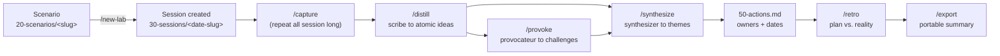

# Ideation Lab Starter

One repo, three surfaces — an **Obsidian vault**, a **Cursor / VS Code / Antigravity
workspace**, and a **Claude Code project** — for planning and running team offsites and
innovation labs. Fork it, drop in a scenario, run the loop, walk away with a synthesized,
shareable summary.

## What this is

A **Scenario** (`20-scenarios/`) is a reusable lab definition — brief, constraints, agenda
seed, prompt pack. A **Session** (`30-sessions/`) is one dated run of a scenario with a real
team. You author scenarios once; you run sessions as often as you like. Five specialized
Claude Code agents (facilitator, scribe, synthesizer, provocateur, librarian) — plus a sixth,
the architect, for growing the repo itself — carry a session from raw notes to a synthesized
recommendation to a portable export, all as plain markdown with YAML frontmatter. No
database, no server, no required plugin — the vault is the app.

## The lifecycle



`/weave` (the librarian) can run at any point in this loop — it regenerates the cross-link
graph from frontmatter and never touches body prose.

## Quickstart

### Obsidian

Open the **repo root** as the vault (not a subfolder). Dot-directories (`.claude/`,
`.cursor/`, `.git/`) are invisible to Obsidian by design. The community plugin **Dataview**
is a recommended optional enhancement (live dashboards) — nothing in the vault requires it to
be correct. Browse [`10-frameworks/index.md`](10-frameworks/index.md) to see the method
library.

### Claude Code

`CLAUDE.md` at the repo root is what Claude Code reads first and treats as authoritative.
Agents in [`.claude/agents/`](.claude/agents/) auto-delegate based on your request; commands
in [`.claude/commands/`](.claude/commands/) are invoked as slash commands. Start with:

```text
/new-lab <scenario-slug> <YYYY-MM-DD> <session-slug>
```

### Cursor / VS Code / Antigravity

`AGENTS.md` at the repo root is a stub that points to `CLAUDE.md` — Cursor reads it natively,
along with `.cursor/rules/`. Other editors and agentic tools that follow the emerging
`AGENTS.md` convention (check your tool's docs) will pick it up the same way. Whichever tool
you're in, the instructions always resolve back to `CLAUDE.md`.

## Walkthrough: a full clinic, end to end

Every piece above has been run once, live, against a fabricated defense-contractor scenario
(`20-scenarios/defense-contractor-strategy/`). The resulting session is left in the vault as a
worked example: [`30-sessions/2026-07-30-strategy-clinic/`](30-sessions/2026-07-30-strategy-clinic/).
Here's what actually happened, block by block, and what to expect running your own.

### Before the day

1. Author or reuse a scenario, then create the session:
   `/new-lab defense-contractor-strategy 2026-07-30 strategy-clinic`.
2. Fill in the session hub's **Constraints** (duration, headcount, room) — the facilitator
   needs these to size an agenda.
3. Invoke the **facilitator**. It read the scenario's `agenda-seed.md` and the framework
   library and built a timeboxed agenda for this room (12 people, one day). Where no existing
   framework fit — turning a dot-vote tally into a comparable pitch, and the owner/action/date
   closing ritual — it seeded two new stub frameworks (`bet-brief`, `commitment-round`) into
   `10-frameworks/` rather than forcing an ill-fitting one. That's expected behavior, not a
   bug: seeded frameworks land `status: seed` for you to field-test and promote later.

### During the day

Run `/capture` early and often — after every block, not just at natural pauses. This demo's
six captures covered the full arc: warm-up answers, HMW stems, crazy-8s sketches, the dot-vote
tally, bet briefs, and premortem output. Capture is deliberately zero-cleanup: raw, timestamped,
append-only. Whoever holds the scribe role in the room shouldn't also be the person arguing
about content — see the agenda's **Materials & roles** section for how this demo assigned it
(the HR/talent lead, chosen for exactly that reason).

### After the day

Run the back half of the loop in order:

```text
/distill → /provoke → /synthesize → 50-actions.md → /retro → /export
```

- **`/distill`** turned the 6 captures into 18 atomic ideas — correctly merging repeated
  mentions of the same bet across multiple captures into one accumulating note instead of
  duplicating it.
- **`/synthesize`** clustered all 18 into 4 named themes with zero left unclustered, and
  proposed a recommendation.
- **`/provoke`**, run against the finished synthesis, challenged the recommendation and the two
  largest themes — all three came back `reshape`. It surfaced something the live premortem
  breakout missed entirely: nobody had pulled the flagship contract's own recompete timeline, a
  cheaper check than either finalist bet's kill test, and it reordered the recommendation.
- Actions and `/retro` captured the fallout honestly: the room's live commitments got
  materially revised *after* the fact by provocation. The retro logs this as both a win (the
  process caught a real gap) and a process gap — see below.
- **`/export`** produced a single portable file with no frontmatter and no wikilinks —
  readable outside the vault, safe to hand to someone who isn't in Obsidian.

### The one lesson worth carrying into your own clinic

This demo ran `/provoke` once, at the end, against the finished synthesis. The retro's own
**Try** section recommends running it earlier instead — against each bet-brief, right after
it's written and *before* the decide gate — so the room's decision benefits from
pressure-testing live, rather than `50-actions.md` quietly diverging from what the room
believed it had committed to. If you're facilitating in person: budget a provoke pass before
the room disperses, not only after.

Full detail: [`40-synthesis.md`](30-sessions/2026-07-30-strategy-clinic/40-synthesis.md) and
[`60-retro.md`](30-sessions/2026-07-30-strategy-clinic/60-retro.md) in the demo session.

## Repo structure

```text
CLAUDE.md              canonical instructions — read this for the full spec
AGENTS.md              stub → CLAUDE.md (Cursor reads this natively)
README.md              this file
.claude/agents/        facilitator, scribe, synthesizer, provocateur, librarian, architect
.claude/commands/      new-lab, capture, distill, synthesize, provoke, weave, retro, export, imagine
.cursor/rules/         00-core (pointer to CLAUDE.md), 10-vault (note-contract enforcement)
.obsidian/             minimal committed vault config
00-start-here/         orientation + fork checklist — start here after cloning
10-frameworks/         evergreen method library (Crazy 8s, HMW, dot voting, premortem, …)
20-scenarios/          drop-in lab definitions; _template/ defines the shape
30-sessions/           dated working folders, one per real event; _template/ defines the shape
90-meta/               taxonomy (allowed field values), linking spec, roadmap, templates
```

## The mental model

| Concept | Definition |
| --- | --- |
| **Framework** | A reusable facilitation method (timebox, steps, output) |
| **Scenario** | A reusable lab definition — brief, constraints, agenda seed, prompts |
| **Session** | One dated run of a scenario with a real team |
| **Capture** | Raw, unedited notes taken during a session |
| **Idea** | One atomic idea distilled from capture — one idea per file |
| **Challenge** | A red-team note targeting an idea, theme, or synthesis |
| **Synthesis** | Clustered themes, tensions, gaps, and a recommendation |
| **Actions** | Committed next steps with owners and dates |
| **Retro** | What happened vs. plan; keep / change / try |

Full schema and lifecycle detail: `CLAUDE.md` §4–§5.

## Agents

| Agent | Does | Writes to |
| --- | --- | --- |
| **facilitator** | Composes a timeboxed agenda from the framework library given the session brief | `10-agenda.md` |
| **scribe** | Distills raw capture into atomic idea notes with valid frontmatter | `30-ideas/`, `_distill-log.md` |
| **synthesizer** | Clusters ideas into named themes; writes tensions, gaps, a recommendation | `40-synthesis.md`, `theme:` on ideas |
| **provocateur** | Red-teams ideas/synthesis — assumptions, kill tests, premortem, steelman | `30-ideas/challenge-*.md` |
| **librarian** | Audits the note contract; regenerates the cross-link graph | Weave blocks; frontmatter fixes |
| **architect** | Envisions repo-level growth beyond the note workflow — new tools, surfaces, integrations | `90-meta/roadmap.md` |

The architect is the odd one out: it proposes repo-level ideas and never touches session
content, and it never implements without being explicitly asked.

## Commands

| Command | Args | Produces |
| --- | --- | --- |
| `/new-lab` | `<scenario-slug> <YYYY-MM-DD> <session-slug>` | New session folder from templates, prefilled |
| `/capture` | freeform text (or file path) | Timestamped raw note in `20-capture/` |
| `/distill` | `[session-path]` (default: latest open) | Atomic ideas + distill log |
| `/synthesize` | `[session-path]` | `40-synthesis.md`, themed ideas |
| `/provoke` | `<target-path or theme>` | Challenge note(s) |
| `/weave` | `[scope-path] \| --all \| --check` | Regenerated link graph + report |
| `/retro` | `[session-path]` | `60-retro.md` |
| `/export` | `[session-path] [--anonymize]` | Single portable summary in `<session>/export/` |
| `/imagine` | `[topic or constraint]` | Proposals in `90-meta/roadmap.md` |

## How the docs fit together

`CLAUDE.md` is the single source of truth; every other instruction surface defers to it and
must never diverge:

| Layer | Holds | Loaded |
| --- | --- | --- |
| `CLAUDE.md` | Contracts, conventions, schemas, guardrails | Always |
| `.claude/commands/*.md` | Step-by-step procedures, one per slash command | On invocation |
| `.claude/agents/*.md` | System prompts for specialized subagents | On delegation |
| `90-meta/taxonomy.md` | Allowed values for schema fields | Referenced by agents |
| `AGENTS.md`, `.cursor/rules/00-core.mdc` | Pointers to `CLAUDE.md` — nothing else | By Cursor |

Want to change a convention? Edit `CLAUDE.md` first, then propagate: taxonomy → affected
command/agent specs → `/weave --check` to catch anything broken.

## Forking this for your own team

1. Fork/clone, open the repo root in Obsidian.
2. Copy `20-scenarios/_template/` → `20-scenarios/<your-slug>/` and fill in your brief,
   agenda seed, and prompt pack.
3. `/new-lab <your-slug> <date> <session-slug>` and run the loop above.

Full checklist, including extending the framework library and taxonomy vocabulary:
[`00-start-here/fork-checklist.md`](00-start-here/fork-checklist.md).

## Design principles

- **Correct without plugins.** Everything that matters is plain markdown + YAML frontmatter;
  Dataview and similar are enhancements layered on top, never a dependency.
- **One idea per file.** Atomic notes are what make clustering, linking, and synthesis
  actually work — see `CLAUDE.md` §5.5.
- **Psychological safety by default.** Ideas are unattributed in generated notes unless a
  session explicitly opts in (`attribution: open`).
- **Generated content is regenerated, never patched.** The weave block at the end of a note
  is fully rebuilt every run and is idempotent by contract — humans and agents alike treat it
  as read-only.
- **One canonical doc.** `CLAUDE.md` wins every conflict; this README summarizes and links,
  it never redefines.
